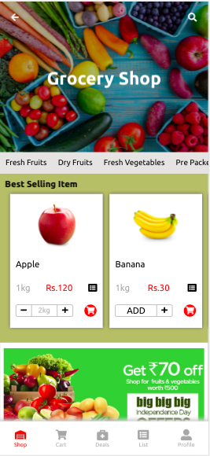
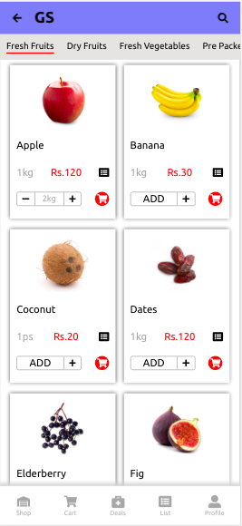
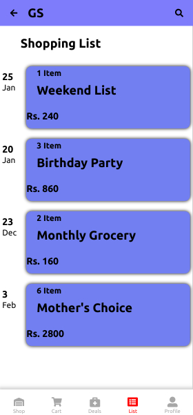
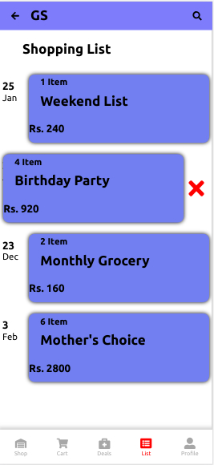
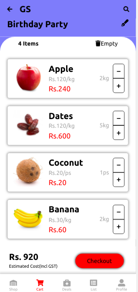

## Instructions for running project

```
git clone https://github.com/rkbansal/Grocery-App.git
cd Grocery-App
npm i
npm start

```

# Note:

This is mobile version dummy web app for grocery-app. so, look as mobile view.
